# Lock Focus 🧠✨
> **An Intent-Aware, Adaptive Cognitive Ecosystem**

**Lock Focus** is a privacy-first web platform designed to assess, track, and improve cognitive focus through adaptive AI and gamified neuro-feedback. It bridges the gap between static content and neurodiverse needs (ADHD/Dyslexia) using real-time attention signals.

---

## 🏗️ Architecture & Data Flow

Lock Focus runs entirely **client-side** to ensure privacy and low latency. It leverages persistent browser storage and local AI models.

```mermaid
graph TD
    User([👤 User]) -->|Interacts| UI[💻 Frontend Interface]
    
    subgraph "Core Application (React + Vite)"
        UI -->|Routing| Router[React Router]
        Router --> Dashboard[📊 ADHD Dashboard]
        Router --> Games[🎮 Gamified Therapy]
        Router --> Tools[🛠️ Accessibility Tools]
    end

    subgraph "AI & Processing Layer (Browser-Native)"
        Direction[Logic]
        TF[🧠 TensorFlow.js] -->|Loads| Blaze[🔥 Blazeface Model]
        Tess[📖 Tesseract.js] -->|OCR| TextProcess[Text Abstraction]
        
        Blaze -->|Real-time Gaze| Attn[Attention State Detection]
        Attn -->|Control Signal| NeuroPilot[🚀 Neuro-Pilot Engine]
    end

    subgraph "Privacy-First Storage"
        Store[(🗄️ Local Storage)]
    end

    NeuroPilot -->|Auto-Steer| Games
    Dashboard -->|Read/Write| Store
    Tools -->|Read| Tess
```

---

## 🚀 Key Features (Hackathon Prototype)

### 1. Neuro-Pilot Mode (Focus Flow) 🕹️
A "self-driving" game mode powered by your attention.
-   **How it works**: Uses `Blazeface` (TensorFlow.js) to detect if you are looking at the screen.
-   **The Pilot**: If you are **Focused**, the ship auto-dodges obstacles and collects points. If you **Look Away**, the ship stops, leading to a crash.
-   **Goal**: Gamifies the act of "sustaining attention" (Neurofeedback).

### 2. Focus Scan ⚡
A reaction-time and visual precision analyzer.
-   **Metrics**: Measures Reaction Time (ms) and Click Accuracy.
-   **Analysis**: Generates a "Cognitive Efficiency" score based on performance.

### 3. Syllable Slasher (Dyslexia Support) ⚔️
A reading assistant game.
-   **Mechanism**: Breaks down complex words into readable syllables (e.g., "Un-be-liev-a-ble").
-   **Impact**: Reduces phonological processing load for dyslexic users.

---

## 🧪 Step-by-Step Judge's Walkthrough

Follow this guide to test the **functional prototype**:

### Step 1: Initialize the App
1.  Open the deployed link or `http://localhost:5173`.
2.  On the Landing Page, scroll down to the **"Vision Simulator"**.
3.  **Try it**: Click **"Dyslexia"** or **"ADHD"** to visually experience the problem statement.

### Step 2: Enter the Dashboard
1.  Click **"Open Prototype"** or **"Dashboard"** in the navigation.
2.  You will land on the **ADHD Dashboard**. Note the real-time "Optimal Focus" metrics.

### Step 3: Test "Neuro-Pilot" (The AI Hero Feature) 🌟
*This requires a webcam. No video is recorded; processing is 100% local.*
1.  Click the **"Training Center"** card or go to **Games -> Focus Flow**.
2.  **Disclaimer**: A privacy modal will appear. Click **"Enable Camera & Continue"**.
3.  **Allow Permission**: Browser will ask for camera access. Allow it.
4.  **Verify HUD**: Look at the top-left corner. You should see "Attention Signal: FOCUSED" (Green).
5.  **Activate**: Click the purple **"NEURO-PILOT"** button.
6.  **The Test**:
    -   **Look at the screen**: The ship drives itself safely.
    -   **Turn your head away**: The ship stops steering.
    -   *This proves the app is reacting to your physical attention in real-time.*

### Step 4: Test "Focus Scan"
1.  Return to Dashboard -> Click **"Focus Scan"** (Top Right Card).
2.  Click **"Start Analysis"**.
3.  Click the grid cells as they light up green.
4.  View your **Results** at the end (Score/Reaction Time).

---

## 💡 Problem & Solution

### The Problem
-   **Static Interfaces**: Traditional UIs ignore user state. They don't know if you are bored, confused, or skimming.
-   **Neurodiversity Gap**: ADHD/Dyslexic users struggle with dense text and lack of feedback.

### The Solution: "Lock Focus"
-   **Adaptive**: Interfaces that react to *you*.
-   **Privacy-First**: Real-time AI that runs on *your device*, not the cloud.
-   **Gamified**: Turning cognitive therapy into engaging experiences.

---

## 🛠️ Tech Stack

-   **Frontend**: React (Vite), Tailwind CSS, Framer Motion
-   **AI/ML**: TensorFlow.js, Blazeface (Face Detection), Tesseract.js (OCR)
-   **Visualization**: Recharts (Analytics), Lucide React (Icons)
-   **Deployment**: Vercel / Netlify

---

## 🔒 Privacy & Ethics Statement

**Camera Usage**: The "Neuro-Pilot" feature uses the webcam solely for real-time face presence detection.
-   ✅ **Local Processing**: All video data is processed in the browser memory.
-   ✅ **No Storage**: No video or images are ever saved, stored, or transmitted to any server.
-   ✅ **Opt-In**: The feature is disabled by default and requires explicit user consent.

---

## 📦 Setup Instructions (Local)

1.  **Clone**: `git clone https://github.com/imarnv/lock-focus.git`
2.  **Install**: `npm install`
3.  **Run**: `npm run dev`
4.  **Visit**: `http://localhost:5173`
