# Lock Focus
> **An Intent-Aware, Adaptive Cognitive Ecosystem**

Lock Focus is a privacy-first web platform designed to assess, track, and improve cognitive focus through adaptive AI and gamified neuro-feedback. It bridges the gap between static content and neurodiverse needs (ADHD/Dyslexia) using real-time attention signals.

---

## Architecture and Data Flow

Lock Focus runs entirely client-side to ensure privacy and low latency. It leverages persistent browser storage and high-precision MediaPipe AI models for gaze estimation.

## System Architecture

The ecosystem is built on a modular component architecture, ensuring separation of concerns between UI, Logic, and AI processing.


## Data Flow Pipeline

A privacy-first pipeline where video feeds are processed instantaneously in memory with zero data transmission.

```mermaid
sequenceDiagram
    autonumber
    participant Cam as 📷 Camera Feed
    participant MP as 🧠 MediaPipe (Face Landmarker)
    participant Engine as ⚙️ Gaze Engine
    participant App as 🎮 Focus Flow / Reader
    participant Store as 💾 LocalStorage

    Note over Cam, Store: 🔒 Privacy Barrier: Local-Only Processing

    Cam->>MP: Raw Video Frame (60fps)
    activate MP
    MP->>Engine: 478 Face Landmarks + Iris Data
    deactivate MP
    
    activate Engine
    Engine->>Engine: Calculate Pupil-to-Corner Ratio
    Engine->>Engine: Analyze Head Pose (Nose/Cheek Vector)
    Engine->>App: Gaze Coordinates (x, y) + Fixation State
    deactivate Engine
    
    activate App
    alt Focus Flow
        App->>App: Update Level Physics / Neuro-Pilot
    else Adaptive Reader
        App->>App: Dynamic Opacity & Font Scaling
    end
    
    App-->>Store: Save Session Metrics via storage.js
    deactivate App
```



---

## Key Features

### 1. High-Precision Gaze Sensing
The core of the ecosystem is a real-time gaze sensing engine powered by MediaPipe Iris Tracking.
- **Mechanism**: Tracks pupil movement relative to the eye corners (canthus) to determine looking direction without requiring fixed calibration.
- **Head Pose Integration**: Combines iris data with head-pose orientation (nose-to-cheek alignment) to detect when a user is "Away" or "Distracted".
- **Stability**: Implements Exponential Moving Average (EMA) smoothing to eliminate tracking jitter.

### 2. Focus Flow: Neuro-Pilot Training
A high-intensity flow trainer that uses the Gaze Sensing engine for input.
- **Neuro-Pilot Mode**: The game steers itself as long as the user maintains focus on the center. Looking away pauses progress.
- **Progression**: Five difficulty levels (Beginner to Master) with scaling speed and session durations.
- **Persistence**: Level unlocks and session history are stored locally to track long-term cognitive endurance.

### 3. Chronos Match (Time Blindness Training)
A rhythm-based estimation game designed to improve internal clock accuracy, specifically for ADHD users.
- **Chaos Mode**: Simulates real-world distractions (notifications, visual noise) to train focus under pressure.
- **Scoring**: Measures millisecond-level estimation accuracy against target durations.

### 4. Adaptive PDF Reader & OCR
A reading environment that proactively responds to the user's attention.
- **Condition-Specific Modes**: Specialized UI profiles for **Dyslexia** (OpenDyslexic-style spacing), **ADHD** (clutter reduction), and **Vision Stress** (muted contrast).
- **OCR Intelligence**: Uses Tesseract.js to convert static images or legacy PDFs into accessible, gaze-reactive text.

---

## Step-by-Step Walkthrough

### Step 1: Initialize the Application
1. Open the application and experience the "Lock Focus" neural intro.
2. Explore "Vision Studio" on the landing page for neuro-diversity simulations.

### Step 2: Access the Dashboard
1. Click "Dashboard" to enter the centralized management hub.
2. Review focus metrics and rolling performance stats.

### Step 3: Test Neuro-Pilot in Focus Flow
1. Navigate to **Games -> Focus Flow**.
2. Enable the camera (Local Processing Only).
3. Start a session in **Neuro-Pilot** mode.
4. Observe how looking left/right steers the ship and looking away pauses the game.

### Step 4: Review Neuro-Analytics
1. Complete a session to generate a **Neuro-Report**.
2. Analyze your **Focus Consistency Score** and estimated **Neural Latency**.

---

## Project Structure

```bash
src/
├── components/        # UI Modules (Aurora, NerveAnimation, VisionSimulator)
├── layouts/           # Page Wrappers (DashboardLayout)
├── hooks/             # Core Logic (useEyeTracking.js - MediaPipe Integration)
├── pages/
│   ├── FocusFlow.jsx        # Neuro-Pilot Game
│   ├── Dashboard.jsx        # ADHD/Focus Management Hub
│   ├── AdaptivePdfReader.jsx # Accessibility OCR Reader
│   ├── TimeBlindnessGame.jsx # Chronos Match
│   ├── SyllableSlasher.jsx   # Literacy Training
│   ├── ZenDrive.jsx         # Peripheral Vision Simulator
│   ├── ProjectPage.jsx      # Landing Experience
│   └── ... (20+ specialized pages)
├── utils/             # Helpers (storage.js - Local Persistence)
└── App.js             # Routing & Dynamic Imports
```

---

## Tech Stack

- **Frontend**: React 18, Vite, Tailwind CSS, Framer Motion
- **AI/ML**: MediaPipe (@mediapipe/tasks-vision), Tesseract.js (OCR)
- **Engine**: Canvas API for high-performance game rendering
- **Storage**: JSON-based Browser LocalStorage Logic (Privacy-First)
- **Icons**: Lucide React

---

## Privacy and Ethics

Lock Focus is built with **Privacy-by-Design**:
- **Zero-Transmission**: Video streams never leave the browser; processing happens in-memory and is discarded immediately.
- **No Biometrics**: We track mathematical vectors (points), not faces or identities.
- **Opt-in Only**: Camera access is explicitly requested per session with clear disclaimers.

---

## Setup Instructions

1. **Clone**: `git clone https://github.com/imarnv/lock-focus.git`
2. **Install**: `npm install`
3. **Run**: `npm run dev`
4. **Access**: `http://localhost:5173`
